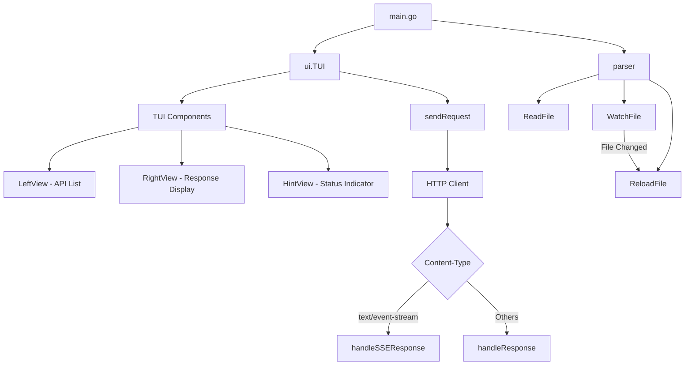

> [!NOTE]
> This README was generated by [Claude Code](https://github.com/pardnchiu/skill-readme-generate), get the ZH version from [here](./README.zh.md).

# go-rest-client

[](https://pkg.go.dev/github.com/pardnchiu/go-rest-client)
[](LICENSE)

> A terminal-based REST API testing tool compatible with VSCode REST Client extension, executes HTTP requests through an intuitive TUI interface and displays responses in real-time.

## Table of Contents

- [Features](#features)
- [Architecture](#architecture)
- [Installation](#installation)
- [Usage](#usage)
- [CLI Reference](#cli-reference)
- [Use Cases](#use-cases)
- [License](#license)
- [Author](#author)
- [Stars](#stars)

## Features

- **TUI Interface**: Intuitive terminal user interface built with `tview`
- **VSCode REST Client Compatible**: Fully compatible with `.http` file format from VSCode REST Client extension
- **Real-time Response**: Displays status codes, headers, response body, and request duration
- **SSE Support**: Real-time display of Server-Sent Events streaming data
- **File Monitoring**: Automatically watches file changes and reloads requests
- **JSON Formatting**: Auto-formats JSON responses for improved readability
- **Multiple Methods**: Supports GET, POST, PUT, DELETE, PATCH, HEAD, OPTIONS
- **Keyboard Navigation**: Quickly switch between views using keyboard shortcuts (Tab / Arrow Keys)

## Architecture



## Installation

### Quick Install (Recommended)

Use the installation script to automatically download the latest version:

```bash
curl -fsSL https://raw.githubusercontent.com/pardnchiu/go-rest-client/main/install.sh | bash
```

Or download and run manually:

```bash
wget https://raw.githubusercontent.com/pardnchiu/go-rest-client/main/install.sh
bash install.sh
```

The script will automatically detect your operating system and architecture, and download the appropriate binary.

### Build from Source

```bash
git clone https://github.com/pardnchiu/go-rest-client.git
cd go-rest-client
go build -o gorc ./cmd/tui
```

### Install to System Path

```bash
sudo cp gorc /usr/sbin/gorc
```

### Install via Go

```bash
go install github.com/pardnchiu/go-rest-client/cmd/tui@latest
# Copy to system path after compilation
sudo cp $(go env GOPATH)/bin/tui /usr/sbin/gorc
```

## Usage

### 1. Create Request File

Create a `test.http` file and define your requests:

```http
### Example GET Request
GET https://api.github.com/users/pardnchiu
Accept: application/json

### Example POST Request
POST https://httpbin.org/post
Content-Type: application/json

{
  "key": "value"
}

### SSE Example
GET https://httpbin.org/stream/10
Accept: text/event-stream
```

### 2. Launch the Application

```bash
gorc
```

### 3. Navigation

| Key | Function |
|-----|----------|
| `Tab` | Switch between API list and response view |
| `←` / `→` | Arrow keys to quickly switch views |
| `Ctrl+C` / `Esc` | Exit the application |
| `Enter` | Select and send the request |

## CLI Reference

### TUI Methods

| Method | Description |
|--------|-------------|
| `NewTUI()` | Initialize TUI application and configure components |
| `UpdateLeftView()` | Update the API list view content |
| `sendRequest(index)` | Send HTTP request and display response |
| `showRequestDetail(req)` | Display request details |

### Parser Methods

| Method | Description |
|--------|-------------|
| `ReadFile(tui, path)` | Parse .http file and load requests |
| `WatchFile(tui)` | Monitor file changes and auto-reload |
| `ReloadFile(tui)` | Reload file and update UI |

### Data Structures

#### Request

```go
type Request struct {
    Name    string            // Request name
    Method  string            // HTTP method (GET, POST, PUT...)
    URL     string            // Request URL
    Headers map[string]string // HTTP headers
    Body    string            // Request body
}
```

#### TUI

```go
type TUI struct {
    App       *tview.Application      // TUI application
    Pages     *tview.Pages            // Page container
    LeftView  *tview.List             // Left API list
    RightView *tview.TextView         // Right response display
    HintView  *tview.TextView         // Bottom status indicator
    Watcher   *fsnotify.Watcher       // File watcher
    Filepath  string                  // Monitored file path
    Requests  []*Request              // Loaded request list
}
```

## Use Cases

### API Testing

Quickly test Restful APIs during development without switching browsers or using command-line tools.

```http
### Create User
POST https://api.example.com/users
Content-Type: application/json

{
  "name": "John Doe",
  "email": "john@example.com"
}
```

### SSE Real-time Monitoring

Monitor Server-Sent Events streaming data in real-time, suitable for real-time notifications or event monitoring.

```http
### Monitor Events
GET https://api.example.com/events
Accept: text/event-stream
```

### Multi-Environment Switching

Quickly switch between `dev.http`, `staging.http`, `prod.http` files to use different environment configurations.

```bash
# Test development environment
gorc dev.http

# Test staging environment
gorc staging.http

# Test production environment
gorc prod.http
```

## License

MIT License

## Author


<h4 style="padding-top: 0">邱敬幃 Pardn Chiu</h4>

<a href="mailto:dev@pardn.io" target="_blank">

</a> <a href="https://linkedin.com/in/pardnchiu" target="_blank">

</a>

## Stars

[](https://www.star-history.com/#pardnchiu/go-rest-client&Date)

***

©️ 2026 [Pardn Chiu](https://linkedin.com/in/pardnchiu)
