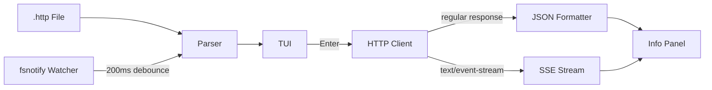

> [!NOTE]
> This README was generated by [SKILL](https://github.com/agenvoy/skill-readme-generate), get the ZH version from [here](./doc/README.zh.md).

***

<strong>RUN YOUR .HTTP FILES RIGHT IN THE TERMINAL!</strong>

***

> A Go terminal REST client with .http file compatibility, hot reload on save, and live SSE streaming

## Table of Contents

- [Features](#features)
- [Architecture](#architecture)
- [License](#license)
- [Author](#author)

## Features

> `go install github.com/pardnchiu/go-rest-client/cmd/tui@latest` · [Documentation](./doc/doc.md)

- **VSCode .http Compatible** — Reuse VSCode REST Client request files as-is and run them straight from the terminal.
- **Hot Reload on Save** — Watches the `.http` file and re-parses it after a 200ms debounce, so the request list updates the moment you save while keeping your current selection.
- **Live SSE Streaming** — Detects `text/event-stream` responses and renders them line by line with a running event count, ideal for debugging LLM or push endpoints.
- **Readable Responses at a Glance** — Color-codes status by 2xx/3xx/4xx, pretty-prints JSON, and shows full headers alongside request duration.
- **Keyboard-Only Split Pane** — Request list on the left, details on the right; arrow keys and Tab cover browsing, sending, and switching.

## Architecture

> [Full Architecture](./doc/architecture.md)

```mermaid
graph LR
    F[.http File] --> P[Parser]
    W[fsnotify Watcher] -->|200ms debounce| P
    P --> T[TUI]
    T -->|Enter| H[HTTP Client]
    H -->|regular response| R[JSON Formatter]
    H -->|text/event-stream| S[SSE Stream]
    R --> V[Info Panel]
    S --> V
```

## License

This project is licensed under the [MIT LICENSE](LICENSE).

## Author

Just [open an issue](https://github.com/pardnchiu/go-rest-client/issues/new) to share an idea.

***

©️ 2026 [邱敬幃 Pardn Chiu](https://www.linkedin.com/in/pardnchiu)
