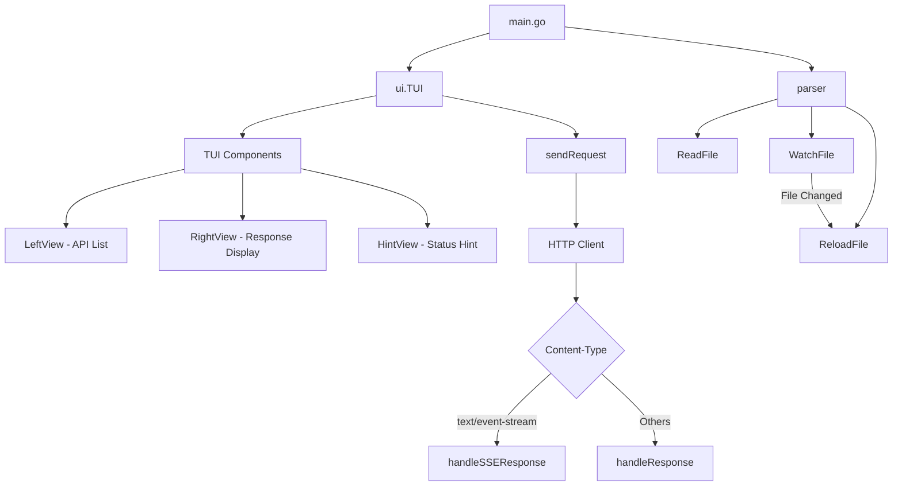

> [!NOTE]
> This README was generated by [Claude Code](https://github.com/pardnchiu/skill-readme-generate), get the ZH version from [here](./README.zh.md).

# go-rest-client

[](https://pkg.go.dev/github.com/pardnchiu/go-rest-client)
[](LICENSE)

> A terminal-based REST API testing tool compatible with VSCode REST Client extension's `.http` file format. Execute HTTP requests through an intuitive TUI interface and display responses in real-time.

## Table of Contents

- [Features](#features)
- [Architecture](#architecture)
- [Installation](#installation)
- [Usage](#usage)
- [CLI Reference](#cli-reference)
- [Use Cases](#use-cases)
- [License](#license)
- [Author](#author)
- [Stars](#stars)

## Features

- **TUI Interface**: Split-panel interface built with `tview` (API list / response display)
- **VSCode REST Client Compatible**: Full support for `.http` file format
- **Real-time Response**: Display status codes, headers, response body, and request duration
- **SSE Support**: Real-time streaming display of Server-Sent Events data
- **File Monitoring**: Automatically detect file changes and reload requests
- **JSON Formatting**: Auto-format JSON responses for improved readability
- **Multiple Methods**: Support GET, POST, PUT, DELETE, PATCH, HEAD, OPTIONS
- **Keyboard Navigation**: Tab and arrow keys for quick view switching

## Architecture



## Installation

### Build from Source

```bash
git clone https://github.com/pardnchiu/go-rest-client.git
cd go-rest-client
go build -o gorc ./cmd/tui
```

### Install to System Path

```bash
sudo cp gorc /usr/local/bin/gorc
```

### Install via Go

```bash
go install github.com/pardnchiu/go-rest-client/cmd/tui@latest
sudo cp $(go env GOPATH)/bin/tui /usr/local/bin/gorc
```

## Usage

### 1. Create Request File

Create an `api.http` file and define your requests:

```http
### Get User Info
GET https://api.github.com/users/pardnchiu
Accept: application/json

###

### Send POST Request
POST https://httpbin.org/post
Content-Type: application/json

{
  "name": "test",
  "value": 123
}

###

### SSE Stream
GET https://httpbin.org/stream/5
Accept: text/event-stream
```

### 2. Launch Application

```bash
gorc api.http
```

### 3. Keyboard Controls

| Key | Function |
|-----|----------|
| `Tab` | Switch between API list and response view |
| `←` / `→` | Arrow keys for quick view switching |
| `↑` / `↓` | Navigate API list |
| `Enter` | Execute selected request |
| `Ctrl+C` / `Esc` | Exit application |

## CLI Reference

### Syntax

```bash
gorc <file.http>
```

### Arguments

| Argument | Description |
|----------|-------------|
| `file.http` | Path to `.http` request file (required) |

### Supported HTTP Methods

| Method | Description |
|--------|-------------|
| `GET` | Retrieve resource |
| `POST` | Create resource |
| `PUT` | Update resource (full) |
| `PATCH` | Update resource (partial) |
| `DELETE` | Delete resource |
| `HEAD` | Get headers only |
| `OPTIONS` | Get supported methods |

### .http File Format

```http
### Request Name
METHOD URL
Header-Name: Header-Value

{request body}

###
```

- `###` serves as request separator
- `### Name` defines request name
- Headers follow immediately after METHOD URL
- Empty line precedes request body
- Supports `//` and `#` comments

## Use Cases

### API Development Testing

Quickly test RESTful APIs during development without switching to browser or using curl.

```http
### Create User
POST https://api.example.com/users
Content-Type: application/json

{
  "name": "John",
  "email": "john@example.com"
}
```

### SSE Real-time Monitoring

Monitor Server-Sent Events streaming data for real-time notifications or event listening.

```http
### Listen Events
GET https://api.example.com/events
Accept: text/event-stream
```

### Multi-environment Switching

Create separate `.http` files for different environments:

```bash
gorc dev.http      # Development
gorc staging.http  # Staging
gorc prod.http     # Production
```

## License

MIT License

## Author


<h4 style="padding-top: 0">邱敬幃 Pardn Chiu</h4>

<a href="mailto:dev@pardn.io" target="_blank">

</a> <a href="https://linkedin.com/in/pardnchiu" target="_blank">

</a>

## Stars

[](https://www.star-history.com/#pardnchiu/go-rest-client&Date)

***

©️ 2026 [邱敬幃 Pardn Chiu](https://linkedin.com/in/pardnchiu)
