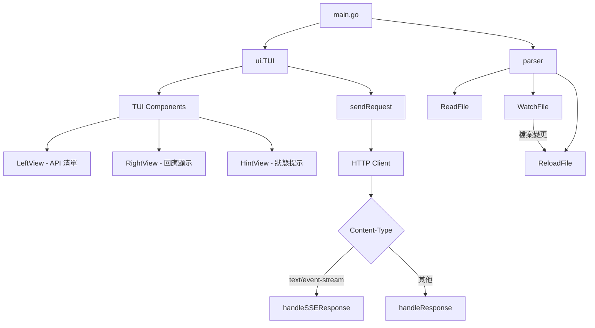

> [!NOTE]
> 此 README 由 [Claude Code](https://github.com/pardnchiu/skill-readme-generate) 生成，英文版請參閱 [這裡](./README.md)。

# go-rest-client

[](https://pkg.go.dev/github.com/pardnchiu/go-rest-client)
[](LICENSE)

> 一個基於終端的 REST API 測試工具，相容 VSCode REST Client 擴充功能，透過直觀的 TUI 介面執行 HTTP 請求並即時查看回應。

## 目錄

- [功能特點](#功能特點)
- [架構](#架構)
- [安裝](#安裝)
- [使用方法](#使用方法)
- [命令列參考](#命令列參考)
- [使用場景](#使用場景)
- [授權](#授權)
- [Author](#author)
- [Stars](#stars)

## 功能特點

- **TUI 介面**：使用 `tview` 建構的直觀終端使用者介面
- **VSCode REST Client 相容**：完全支援 VSCode REST Client 擴充功能的 `.http` 檔案格式
- **即時回應**：顯示狀態碼、標頭、回應主體與請求耗時
- **SSE 支援**：即時顯示 Server-Sent Events 串流資料
- **檔案監聽**：自動監控檔案變更並重新載入請求
- **JSON 格式化**：自動格式化 JSON 回應以提升可讀性
- **多重方法**：支援 GET、POST、PUT、DELETE、PATCH、HEAD、OPTIONS
- **切換導航**：鍵盤快捷鍵（Tab / 左右方向鍵）快速切換視圖

## 架構



## 安裝

### 快速安裝（推薦）

使用安裝腳本自動下載最新版本：

```bash
curl -fsSL https://raw.githubusercontent.com/pardnchiu/go-rest-client/main/install.sh | bash
```

或手動下載並執行：

```bash
wget https://raw.githubusercontent.com/pardnchiu/go-rest-client/main/install.sh
bash install.sh
```

腳本會自動偵測您的作業系統與架構，並下載對應的二進位檔。

### 從原始碼編譯

```bash
git clone https://github.com/pardnchiu/go-rest-client.git
cd go-rest-client
go build -o gorc ./cmd/tui
```

### 安裝至系統路徑

```bash
sudo cp gorc /usr/sbin/gorc
```

### 使用 Go 安裝

```bash
go install github.com/pardnchiu/go-rest-client/cmd/tui@latest
# 編譯後複製至系統路徑
sudo cp $(go env GOPATH)/bin/tui /usr/sbin/gorc
```

## 使用方法

### 1. 建立請求檔案

建立 `test.http` 檔案並定義請求：

```http
### 範例 GET 請求
GET https://api.github.com/users/pardnchiu
Accept: application/json

### 範例 POST 請求
POST https://httpbin.org/post
Content-Type: application/json

{
  "key": "value"
}

### SSE 範例
GET https://httpbin.org/stream/10
Accept: text/event-stream
```

### 2. 啟動程式

```bash
gorc
```

### 3. 導航操作

| 按鍵 | 功能 |
|------|------|
| `Tab` | 在 API 清單與回應視圖間切換 |
| `←` / `→` | 左右方向鍵快速切換視圖 |
| `Ctrl+C` / `Esc` | 退出程式 |
| `Enter` | 選取並發送請求 |

## 命列參考

### TUI 方法

| 方法 | 說明 |
|------|------|
| `NewTUI()` | 初始化 TUI 應用程式並配置各組件 |
| `UpdateLeftView()` | 更新 API 清單視圖內容 |
| `sendRequest(index)` | 發送 HTTP 請求並顯示回應 |
| `showRequestDetail(req)` | 顯示請求詳細資訊 |

### Parser 方法

| 方法 | 說明 |
|------|------|
| `ReadFile(tui, path)` | 解析 .http 檔案並載入請求 |
| `WatchFile(tui)` | 監控檔案變更並自動重載 |
| `ReloadFile(tui)` | 重新載入檔案並更新 UI |

### 資料結構

#### Request

```go
type Request struct {
    Name    string            // 請求名稱
    Method  string            // HTTP 方法 (GET, POST, PUT...)
    URL     string            // 請求 URL
    Headers map[string]string // HTTP 標頭
    Body    string            // 請求主體
}
```

#### TUI

```go
type TUI struct {
    App       *tview.Application      // TUI 應用程式
    Pages     *tview.Pages            // 頁面容器
    LeftView  *tview.List             // 左側 API 清單
    RightView *tview.TextView         // 右側回應顯示
    HintView  *tview.TextView         // 底部狀態提示
    Watcher   *fsnotify.Watcher       // 檔案監視器
    Filepath  string                  // 監控檔案路徑
    Requests  []*Request              // 已載入的請求清單
}
```

## 使用場景

### API 測試

在開發階段快速測試 Restful API，無需切換瀏覽器或使用命令列工具。

```http
### 建立使用者
POST https://api.example.com/users
Content-Type: application/json

{
  "name": "John Doe",
  "email": "john@example.com"
}
```

### SSE 即時監控

即時追蹤 Server-Sent Events 串流資料，適用於即時通知或事件監控。

```http
### 監聽即時事件
GET https://api.example.com/events
Accept: text/event-stream
```

### 多環境切換

在 `dev.http`、`staging.http`、`prod.http` 等檔案間快速切換，使用不同環境設定。

```bash
# 測試開發環境
gorc dev.http

# 測試測試環境
gorc staging.http

# 測試正式環境
gorc prod.http
```

## 授權

MIT License

## Author


<h4 style="padding-top: 0">邱敬幃 Pardn Chiu</h4>

<a href="mailto:dev@pardn.io" target="_blank">

</a> <a href="https://linkedin.com/in/pardnchiu" target="_blank">

</a>

## Stars

[](https://www.star-history.com/#pardnchiu/go-rest-client&Date)

***

©️ 2026 [邱敬幃 Pardn Chiu](https://linkedin.com/in/pardnchiu)
