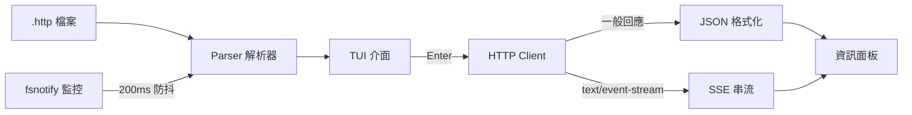

> [!NOTE]
> 此 README 由 [SKILL](https://github.com/agenvoy/skill-readme-generate) 生成，英文版請參閱 [這裡](../README.md)。

---

<strong>RUN YOUR .HTTP FILES RIGHT IN THE TERMINAL!</strong>

---

> Go 終端機 REST 客戶端，具備 `.http` 檔案相容、存檔即時重載與 SSE 串流顯示

## 目錄

- [功能特點](#功能特點)
- [架構](#架構)
- [授權](#授權)
- [Author](#author)

## 功能特點

> `go install github.com/pardnchiu/go-rest-client/cmd/tui@latest` · [完整文件](./doc.zh.md)

- **相容 VSCode .http 格式** — 直接沿用 VSCode REST Client 的請求檔，不需改寫即可在終端機執行。
- **存檔即時重載** — 監控 `.http` 檔變動並經 200ms 防抖（Debounce）重新解析，編輯器存檔後清單立即更新且保留目前選取位置。
- **SSE 串流即時顯示** — 偵測 `text/event-stream` 回應後逐行渲染，邊收邊顯示並統計事件數，適合除錯 LLM 或推播類端點。
- **回應一眼可讀** — 狀態碼依 2xx／3xx／4xx 上色，JSON 自動縮排，並附完整 Header 與請求耗時。
- **純鍵盤雙欄介面** — 左欄請求清單、右欄詳細資訊，方向鍵與 Tab 即可完成瀏覽、送出與切換。

## 架構

> [完整架構](./architecture.zh.md)

## 授權

本專案採用 [MIT LICENSE](../LICENSE)。

## Author

Just [open an issue](https://github.com/pardnchiu/go-rest-client/issues/new) to share an idea.

---

©️ 2026 [邱敬幃 Pardn Chiu](https://www.linkedin.com/in/pardnchiu)
