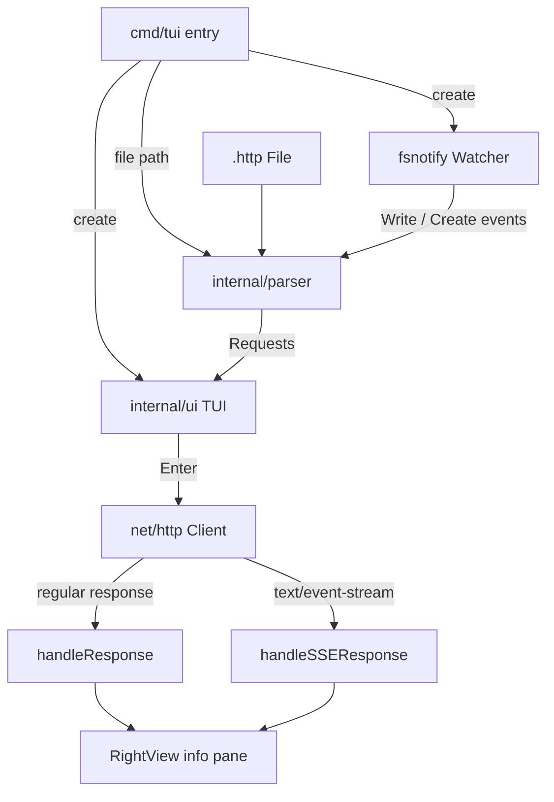
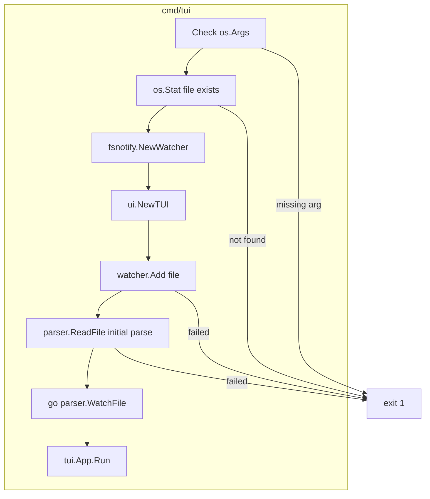
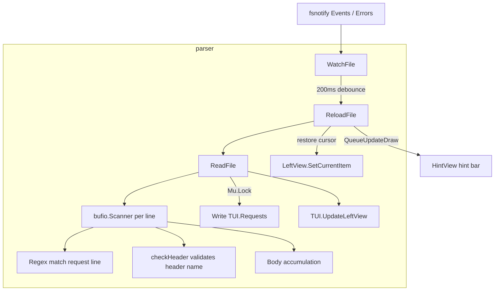
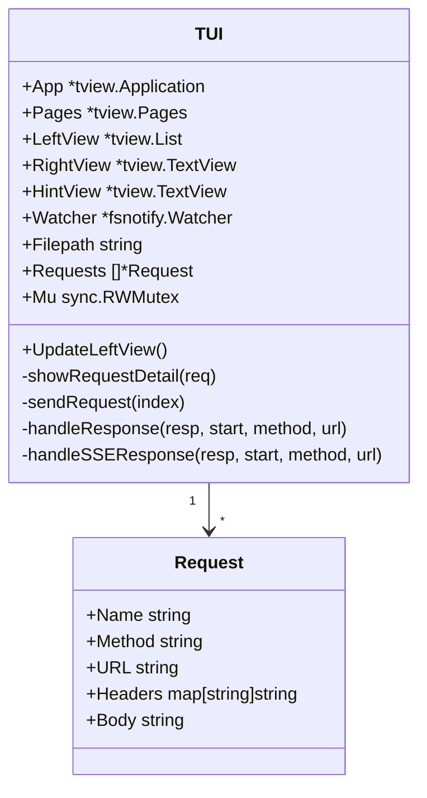
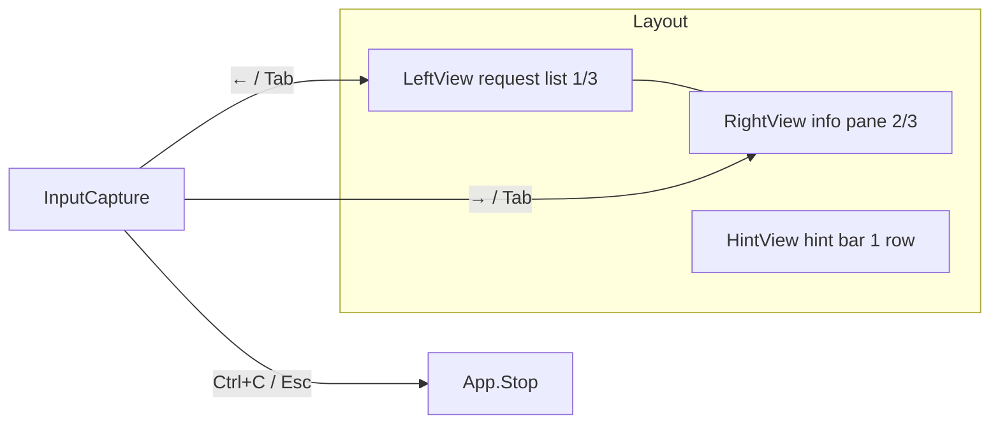
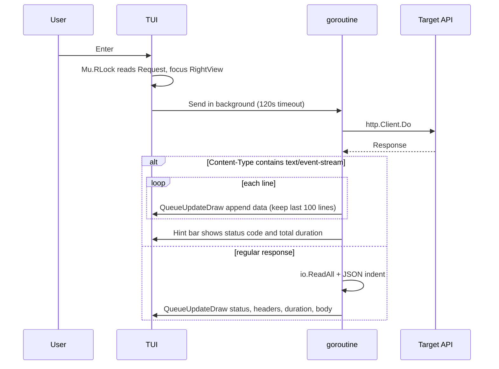
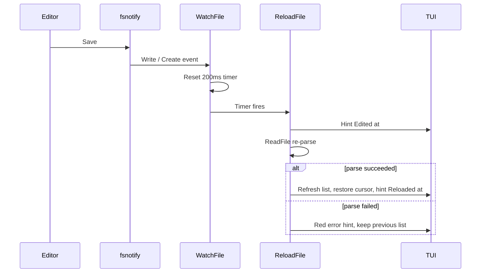
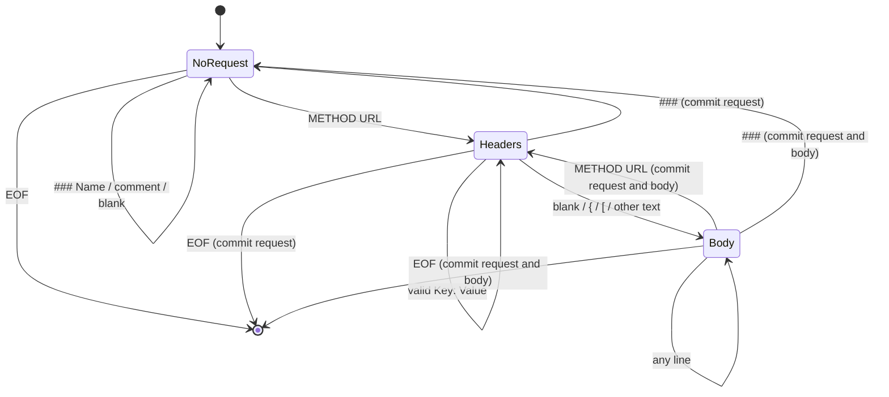

# go-rest-client - Architecture

> Back to [README](../README.md)

## Overview

## Module: cmd/tui

Validates CLI arguments, wires the watcher and TUI, performs the initial parse, and starts the event loop.

## Module: internal/parser

Parses the `.http` file line by line into `[]*ui.Request` and watches the file to trigger reloads.

## Module: internal/ui

Builds the split-pane interface with tview and handles key bindings, request dispatch, and response rendering.

## Data Flow

## State Machine

State transitions while `ReadFile` parses each line:

***

©️ 2026 [邱敬幃 Pardn Chiu](https://www.linkedin.com/in/pardnchiu)
