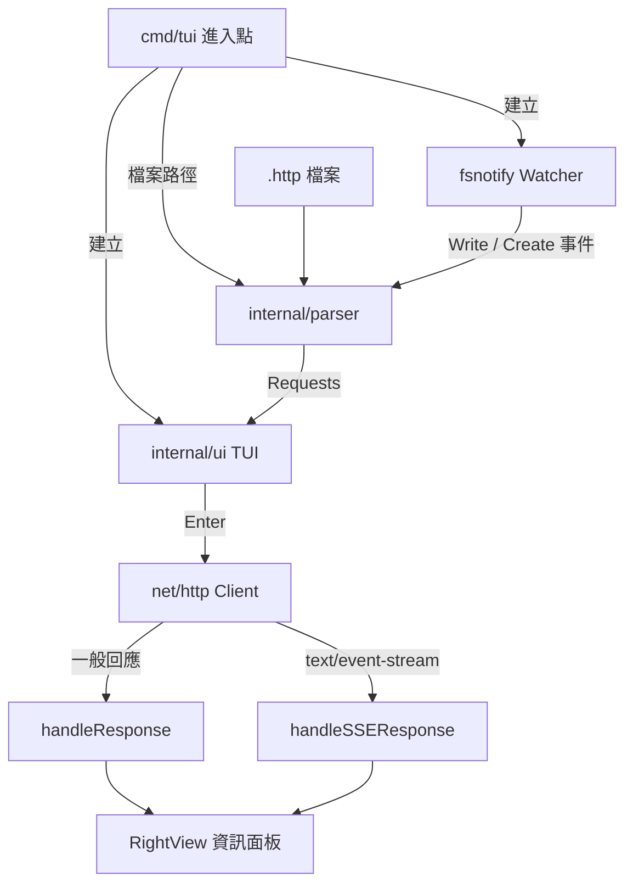
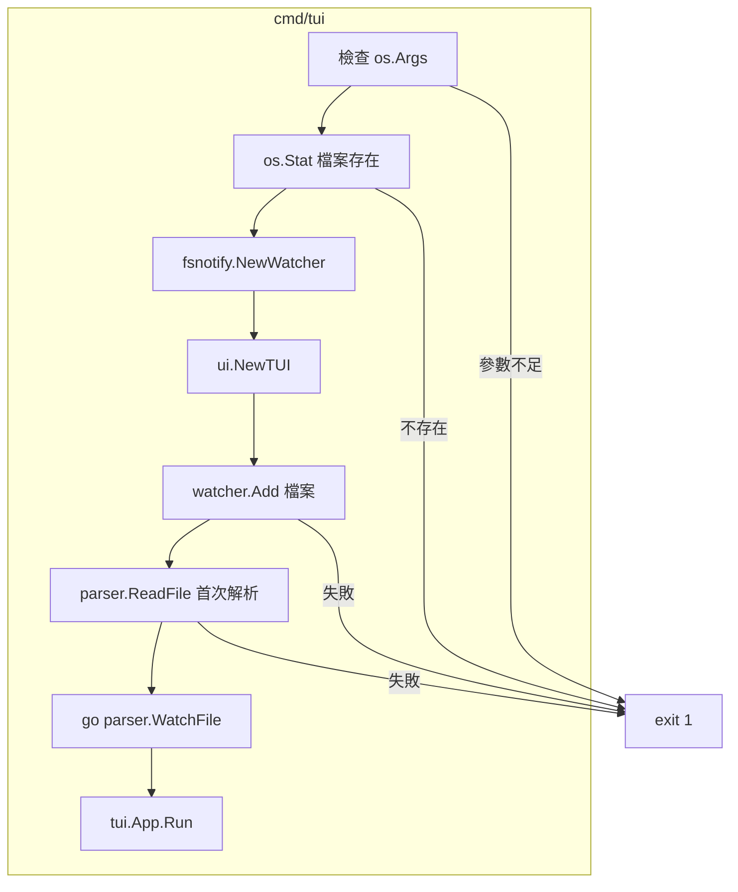
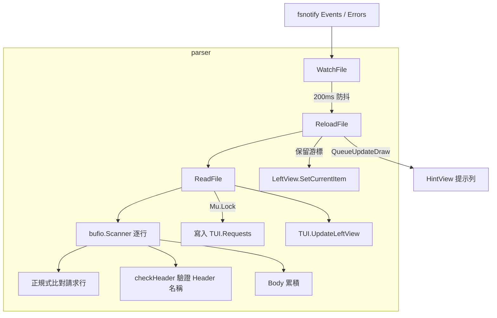
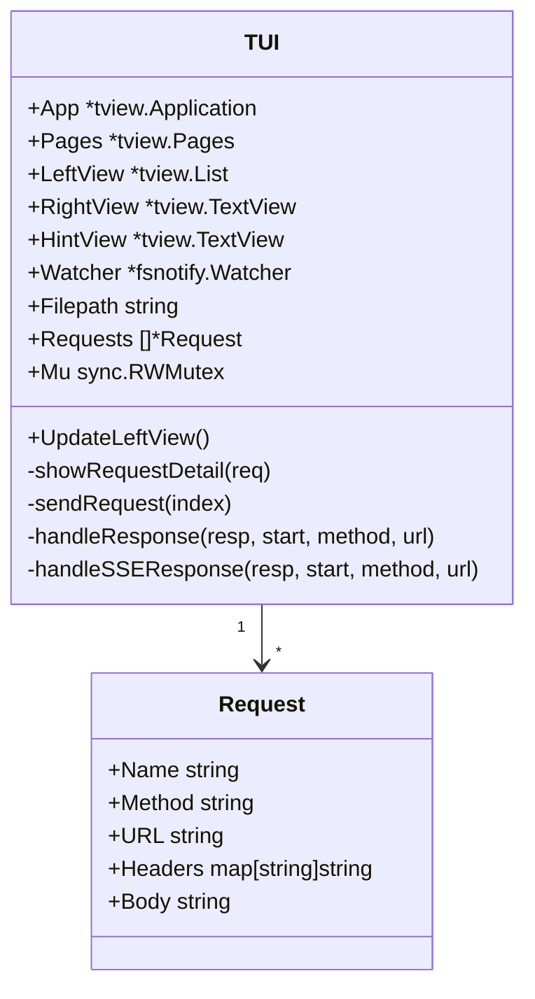
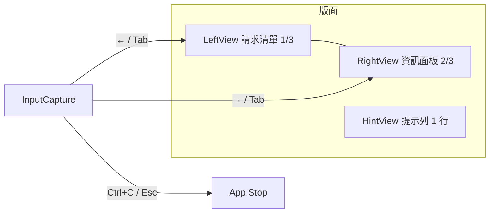
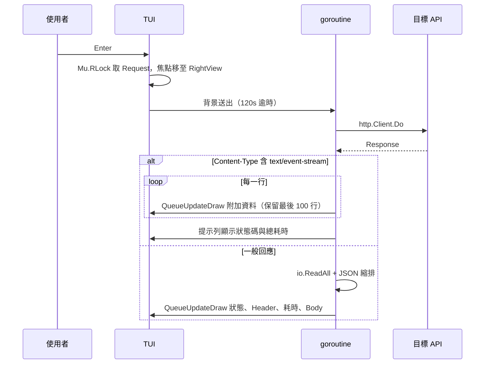
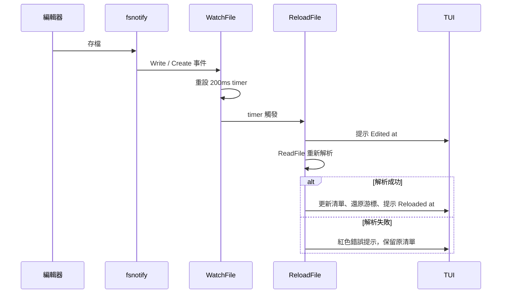
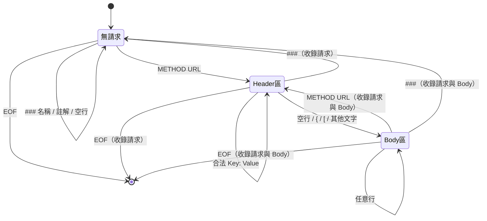

# go-rest-client - 架構

> 返回 [README](./README.zh.md)

## 概覽

## Module: cmd/tui

驗證命令列參數、組裝 Watcher 與 TUI，完成首次解析後啟動事件迴圈。

## Module: internal/parser

將 `.http` 檔逐行解析為 `[]*ui.Request`，並監控檔案變動觸發重載。

## Module: internal/ui

以 tview 建構雙欄介面，負責按鍵綁定、請求送出與回應渲染。

## 資料流

## 狀態機

`ReadFile` 逐行解析時的狀態轉換：

***

©️ 2026 [邱敬幃 Pardn Chiu](https://www.linkedin.com/in/pardnchiu)
